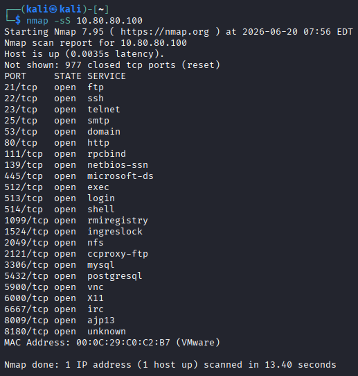
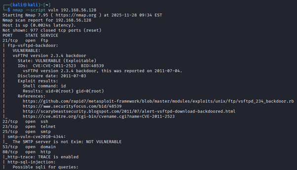
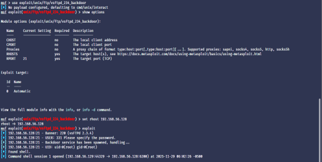
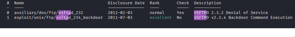

FTP Security Assessment – Metasploitable 2 (Port 21)
OBJECTIVE

The objective of this project is to perform a security assessment of the FTP service running on port 21 in Metasploitable 2 using Nmap and manual testing techniques in a controlled lab environment.
ENVIRONMENT SETUP

Target: Metasploitable 2 (Vulnerable Virtual Machine)
Attacker: Kali Linux
Network: Host-only / NAT (VirtualBox or VMware
TOOLS USED

Nmap
FTP client
Kali Linux utilities
METHODOLOGY

Network scanning and host discovery
Port scanning to identify open services (port 21)
Service version detection using Nmap
Manual FTP connection testing
Verification of anonymous login access
FINDINGS
EVIDENCE

 
FTP service running on port 21 detected
Anonymous login enabled
Cleartext communication observed
Potential unauthorized access risk identified
EVIDENCE

RECOMMENDATION

Disable anonymous FTP access
Use SFTP or FTPS instead of FTP
Restrict port 21 using firewall rules
Enforce strong authentication mechanisms

ETHICAL DISCLAIMER
This assessment was conducted in a controlled virtual environment (Metasploitable 2) for educational and cybersecurity learning purposes only.
